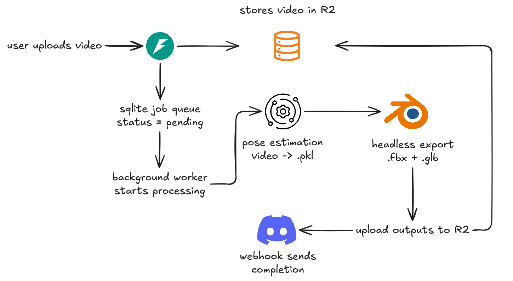

# Metanoia

AI-powered motion capture pipeline that converts video input into game-ready 3D animations.

## What It Is

Metanoia is a full-stack motion capture pipeline built as a web application. It bridges the gap between raw video footage and game-ready 3D animation assets — a process that traditionally requires expensive motion capture hardware and specialized software expertise.

A user uploads a short video of a person moving. The system automatically runs pose estimation, reconstructs a 3D skeleton from the 2D video frames, and exports the result as an FBX and glTF file. The FBX is immediately usable in Unity, Unreal Engine, or Blender. The glTF renders as a live 3D preview directly in the browser.

## Purpose

Motion capture is one of the most expensive and inaccessible parts of game and animation production. Professional mocap suits cost thousands of dollars. Studio time is billed by the hour. Small studios and independent developers are largely locked out.

Metanoia exists to make mocap accessible. The only input required is a video. No suits, no markers, no studio. The pipeline runs entirely on a local GPU and outputs files that drop directly into any standard game engine workflow.

This project was built as a working MVP to validate the technical feasibility of a video-to-animation pipeline using open-source ML tooling, with a production-oriented architecture designed for real deployment.




## Tech Stack

| Layer | Technology |
|---|---|
| Frontend | HTML, CSS, JavaScript, Three.js |
| Backend | FastAPI, Uvicorn, Python |
| ML Pipeline | VIBE, Blender 2.83 |
| Storage | Cloudflare R2 |
| Database | SQLite |
| Notifications | Discord Webhook |

## Middleware Integrations and Mechanisms

### VIBE (Video Inference for Body Pose and Shape Estimation)
VIBE is an open-source ML library that performs 3D human pose estimation from monocular video. It takes a video file as input and outputs a `.pkl` file containing per-frame 3D pose data for each detected person. Metanoia invokes VIBE via `subprocess`, passing the downloaded video path and output directory. The subprocess uses the conda environment's Python binary directly, keeping VIBE's dependencies fully isolated from the backend.

### Blender (Headless Export)
Blender 2.83 is invoked headlessly via `subprocess` to convert VIBE's `.pkl` output into standard 3D formats. Two export commands run sequentially — one producing FBX for game engine import, one producing glTF binary (`.glb`) for browser rendering. Blender runs with `--background` flag and executes VIBE's `fbx_output.py` script internally. All paths are absolute and the working directory is set to the VIBE root to ensure SMPL model assets resolve correctly.

### Cloudflare R2
R2 is used as the object storage layer for all file I/O between the frontend, backend, and ML pipeline. Input videos are uploaded directly from the browser via the backend to R2 on submission. Output FBX and glTF files are uploaded to R2 by the background worker after export. The bucket's public development URL is enabled, allowing the frontend to load the `.glb` directly into Three.js without a proxy. R2 is S3-compatible and is accessed via `boto3`.

### SQLite Job Queue
Job state is tracked in a local SQLite database managed by the backend. Each job record stores the job ID, status, input R2 key, output R2 keys, error message, and creation timestamp. The background worker updates job status at each stage of the pipeline — `pending` → `processing` → `done` or `failed`. The frontend polls `GET /job/{job_id}` every 3 seconds until the job resolves. This provides async job tracking without requiring Redis, Celery, or any external queue infrastructure.

### FastAPI Background Tasks
Long-running ML jobs are handled via FastAPI's `BackgroundTasks`. When a process request is received, the job is created immediately and the response returns the job ID — the client never waits for VIBE to finish. The background task handles the full pipeline: R2 download, VIBE execution, Blender export, R2 upload, and Discord notification.

### Discord Webhook
On job completion, the backend sends a POST request to a Discord webhook URL with a rich embed payload. The embed includes the job ID, gender, status, and direct download links for both the FBX and glTF files from R2. The webhook call is wrapped in try/except so notification failures never affect job status.

### Three.js glTF Viewer
The frontend uses Three.js with `GLTFLoader` and `OrbitControls` to render the `.glb` output directly in the browser. On job completion, the glTF URL is constructed from the R2 public base URL and the `output_gltf_key` returned by the job endpoint. The viewer initializes an `AnimationMixer` to play the motion capture animation, and `OrbitControls` allows the user to rotate and zoom the model freely.

## Project Structure

```
metanoia/
├── VIBE/               # ML library (pose estimation + export)
├── backend/            # FastAPI server
│   ├── main.py         # API endpoints and background worker
│   ├── db.py           # SQLite job table
│   ├── jobs.db         # Job state (auto-generated)
│   └── .env            # Environment variables
└── client/             # Frontend
    ├── index.html
    ├── style.css
    ├── script.js
    └── assets/
        └── metanoia-logo.png
```

## Pipeline

```
User uploads video
       ↓
Backend stores video in Cloudflare R2
       ↓
Job created in SQLite (status: pending)
       ↓
Background worker downloads video locally
       ↓
VIBE runs pose estimation → vibe_output.pkl
       ↓
Blender exports FBX → fbx_output.fbx
Blender exports glTF → model.glb
       ↓
Both files uploaded to R2
       ↓
Job marked done → Discord webhook fires
       ↓
Frontend polls /job/{job_id} → renders glTF in Three.js
User downloads FBX
```

## API Endpoints

| Method | Endpoint | Description |
|---|---|---|
| POST | `/upload` | Upload video and gender, store in R2 |
| POST | `/process` | Create job and start background worker |
| GET | `/job/{job_id}` | Poll job status and retrieve output keys |

## Setup

### Backend Dependencies
pip install -r backend/requirements.txt

### VIBE Dependencies
# Option 1 — restore full conda environment
conda env create -f vibe-environment.yml

# Option 2 — manual install if Option 1 fails due to CUDA mismatch
conda create -n vibe-env python=3.7
conda activate vibe-env
pip install torch==1.8.1+cu111 torchvision==0.5.0 -f https://download.pytorch.org/whl/torch_stable.html
pip install -r VIBE/requirements.txt

### Prerequisites

- Python 3.x (backend venv)
- Conda environment `vibe-env` with VIBE dependencies
- Blender 2.83 installed at `/home/<user>/blender-2.83.20-linux-x64/`
- Cloudflare R2 bucket with public development URL enabled
- Discord webhook URL

### Environment Variables

Create `backend/.env`:

```
R2_ACCOUNT_ID=your_account_id
R2_ACCESS_KEY_ID=your_access_key
R2_SECRET_ACCESS_KEY=your_secret_key
R2_BUCKET_NAME=your_bucket_name
DISCORD_WEBHOOK_URL=https://discord.com/api/webhooks/...
```

### Running the Backend

```bash
cd backend
source venv/bin/activate
uvicorn main:app --reload --port 8001
```

### Running the Frontend

Open `client/index.html` directly in a browser, or serve it with any static file server.

### VIBE Startup Checklist

```bash
cd VIBE
conda activate vibe-env
python -c "import torch; print(torch.cuda.is_available())"  # should print True
```

## Job States

| Status | Description |
|---|---|
| `pending` | Job created, worker not yet started |
| `processing` | Worker running VIBE and Blender |
| `done` | Output files ready in R2 |
| `failed` | Pipeline error, check `error` field |

## Known Limitations

- VIBE has GPU memory constraints. Videos should be under 10 seconds. Lower `--vibe_batch_size` to `32` if VRAM errors occur.
- The backend venv and VIBE conda environment are intentionally isolated. Do not merge them.
- Blender must be invoked with absolute paths and must run with `cwd` set to the VIBE directory.
- Public R2 development URL is enabled for frontend asset delivery. For production, replace with presigned URLs.
- Discord OAuth is not implemented. Webhook notification only.

## Team

John Harold A. Alejo — Technical Lead

Cyrus Kirby Gaor

Joshearie Landicho

Bradley Kjiel Pasalo
